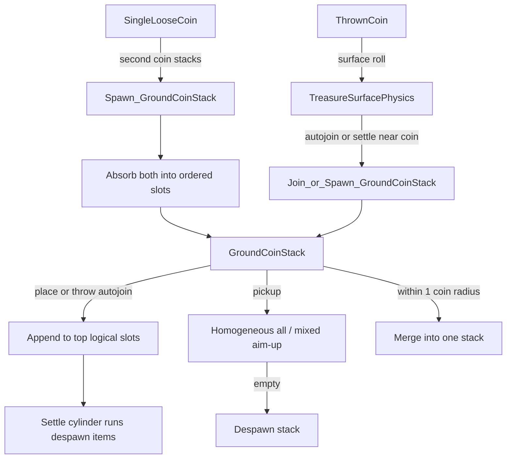

# Ground coin stack owned-object redesign

## Status
Implemented (2026-07-22). Settled stacks kinematic; throws still roll on treasure surface until join/create.

## Key types
- `GroundCoinStack` — owned ground coin tower
- `CoinColumnCylinderBinder.BindDefinitions` — cylinder segments from logical slots
- Placement ghost volume + `DragonLoot/Placement Ghost` shader

## Problem
Ground stacks today are implicit columns of loose `TreasureItem`s (`TreasureSupportStack` + `GroundTreasureStackTarget` pending height + restack/bind). That fights spam deposits, mixed visuals, pickup, and floor seating. `CoinStackInteractable` works because it owns count + collider + visual.

## Target model

### New type: `GroundCoinStack`
One owned component for all player-made ground stacks (separate from authored `CoinStackInteractable`).

| Concern | Behavior |
|---|---|
| Spawn | When a **second** stackable coin joins a lone loose coin (place or auto-stack after surface settle) |
| Despawn | When logical count hits 0 |
| Data | Ordered list of `TreasureDefinition` (placement order) + in-flight list |
| Max height | Global cap **1000** (definition-driven) |
| Collider | **One** capsule; pivot = **surface contact** (bottom on floor/prop) |
| Physics (settled stack) | Fully **kinematic / immovable**; no shove; stack itself does not surface-roll |
| Physics (thrown coins) | **May roll on treasure surface heightfield** until auto-join / create stack / settle as lone coin |
| Sorted | **Not** sorted treasure |
| Merge | Two `GroundCoinStack`s within ~1 coin radius merge |

**This pass contents:** `TreasureCategory.Coin` + `canStack`. Gems never. Architecture stores ordered definitions for future non-coin `canStack`.

**Unchanged:** hand carry, display tables, authored `CoinStackInteractable`, heightfield gold piles.

## Visual rules
- Contiguous same-type runs ≥ `minCountForCylinder`: cylinder segment(s); those settled coins despawned (logical only).
- Shorter runs / mixed tops: live individual items so every slot is visible.
- Spacing: one `TreasureStackSpacing` step per slot; bottom-on-floor pivot.
- Reuse `CoinColumnCylinderBinder`.

## Interaction rules

**Place / throw**
- Always append to **top**.
- Direct place + throw auto-join both work.
- Thrown coins use existing treasure surface roll; on settle/auto-stack they join or spawn `GroundCoinStack`.
- Spam-click hard requirement: slot index = settled + in-flight count.
- Can **add** while in-flight; **cannot pick up** until in-flight empty.
- Stacks sit on floor/props; not on gold piles; tables/authored stacks unchanged.

**Pickup**
- Homogeneous: take entire stack (capacity-limited).
- Mixed: from aimed slot upward.
- Remainder keeps same `GroundCoinStack` instance.

**Ghost**
- Slightly oversized volume over the **whole** vertical stack.
- New placement-ghost shader.
- Still hide on heightfield gold piles.

## Implementation order
1. `GroundCoinStack` core: spawn on 2nd coin, append, settle/despawn-by-cylinder-rules, capsule, despawn when empty
2. Wire place + throw auto-join (after surface roll) + spam-safe in-flight count
3. Pickup (homo all / mixed aim-up) + no-pickup-while-in-flight
4. Merge nearby stacks
5. Ghost volume + new shader
6. Remove obsolete loose-column coin paths / pending-height for ground coins
7. Playtest: spam place, mixed order, cylinders, partial pickup, merge, throw→roll→join, gold-pile ghost hidden

## Success criteria
- N coins look exactly N steps tall, in place order
- Spam depositing never skips/overlaps slots
- Homogeneous pickup takes all; mixed takes aim→top
- No pickup until flights finish; adds still allowed
- Throws can roll on heightfield, then join/create stack
- Empty stack gone; nearby stacks merge
- Hand / tables / authored coin stacks / gold piles unchanged
